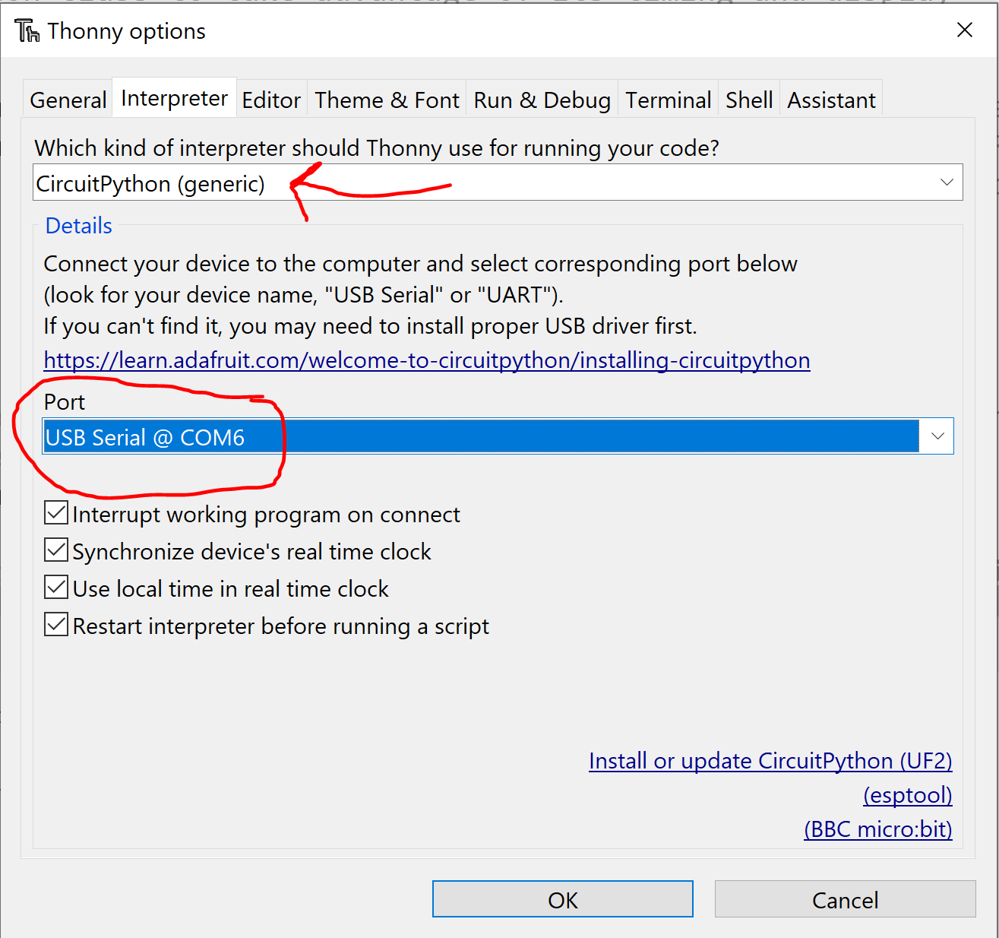
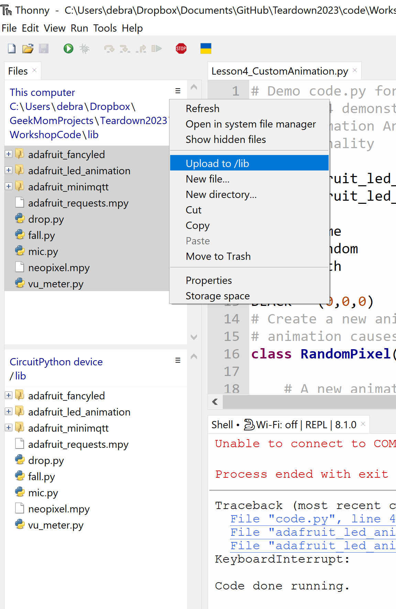
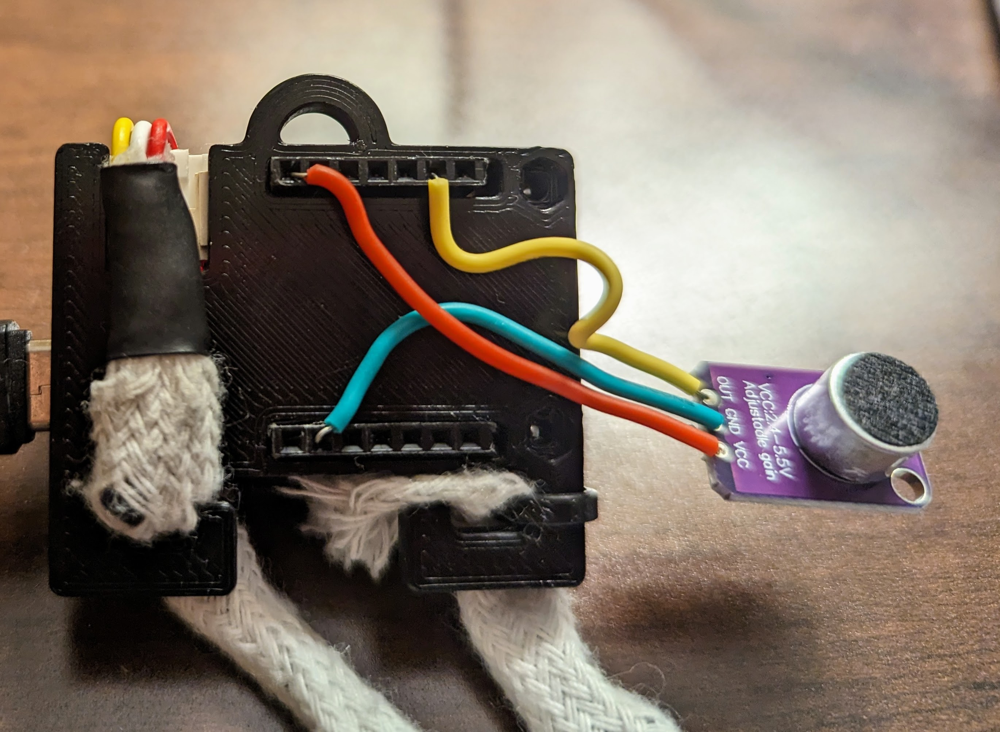

# "LED Animations with CircuitPython" workshop at [Teardown 2023](https://www.crowdsupply.com/teardown/portland-2023)

## Workshop Info

### **Please bring a laptop with the [Thonny IDE](https://thonny.org/) pre-installed.**

We will assemble and code an LED lanyard kit controlled by the [LilyGo T-OI Plus](https://www.lilygo.cc/products/t-oi-plus?variant=42306652143797) board. This board is useful for wearables because it contains a charging circuit and holder for a 16340 LiIon battery, an on-off switch, as well as a Grove Pin adapter, which we will use to attach a section of [LED string containing 20 LEDs with 5mm spacing](https://www.aliexpress.us/item/3256805296356090.html).

If you prefer not to purchase a lanyard kit, you may bring your own microcontroller with CircuitPython installed along with an LED string or strip to display the animations.

### Installing CircuitPython
[General instructions are in this Adafruit guide](https://learn.adafruit.com/welcome-to-circuitpython/installing-circuitpython) and if you are using 
the LilyGo T-OI board you can use the easy online installer by clicking the "open installer" button [on this page](https://circuitpython.org/board/lilygo_ttgo_t-oi-plus/)

### Connect your controller to Thonny
Attach the controller to your computer with the appropriate USB cable. Determine which port it is connected to. Within Thonny, select the *Tools->Options* menu.
In the dialog box that pops up, open the *Interpreter* tab and specify "Generic CircuitPython" for the interpreter and select the port your microcontroller 
is connected to. 

When a connection is made, you should see the REPL (Read-Eval-Print Loop) appear in the bottom pane. If you see a message saying it can't 
connect, try pressing the "Stop/Restart" button on Thonny's toolbar.

### Download Workshop Code
Download this repositor, and unzip it. Copy the contents of the "lib" folder over to the controller. If you are using the LilyGo T-OI board, the easiest way to do
this is with the Thonny IDE. On the left side of Thonny are two panes showing the directory structure on the computer and on the microcontroller. Navigate to the
source folder in the computer pane and the destination folder in the microcontroller pane. In the computer pane, highlight the files you'd like to copy
to the controller, click the three small horiontal bars to open the menu and select the option to upload the highlighted files to the directory that
is open in the controller pane.

### Lanyard Kit

If you receive a lanyard kit to use at the workshop, [instructions for assembly are here](/lanyard/README.md)

###Attaching the Microphone
The wires on the microphone attach to the 3.3V (red), GND (green) and IO4 (yellow) pins in the female header on the T-OI board.
Unfortunately, the hookup wire I used is a bit thin, so you may have to tape the wires in place to get them to stay.

## Resources

- [Adafruit Introduction to CircuitPython](https://learn.adafruit.com/welcome-to-circuitpython/overview)
- [Adafruit LED Animations Library Tutorial](https://learn.adafruit.com/circuitpython-led-animations/overview)
- [Adafruit LED Animations Library Source](https://github.com/adafruit/Adafruit_CircuitPython_LED_Animation/tree/main)
