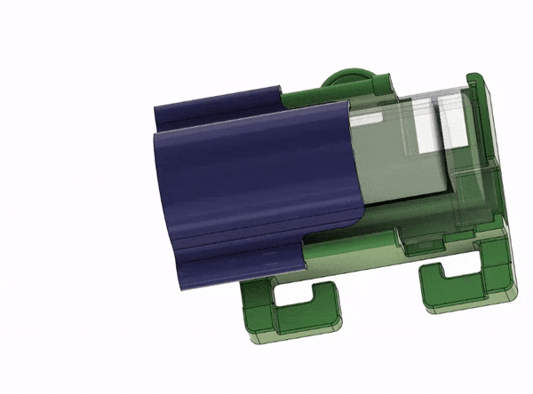

# Lanyard Kit Assembly and Use

If you purchased an LED lanyard kit ($20) to use at the Teardown 2023 workshop, it should contain the following components:
 - [LilyGo T-OI Plus board](https://www.lilygo.cc/products/t-oi-plus?variant=42306652143797) with female header pins pre-soldered
 - Rechargeable cylindrical 16340 Li-Ion battery (3.7V)
 - [LED string containing 20 LEDs with 5mm spacing](https://www.aliexpress.us/item/3256805296356090.html) with attached Grove connector
 - USB C data cable
 - MAX4466 Electret microphone amplifier with hookup wire
 - 1m (approx) length of drawstring cord
 - 3D printed case and lid for the LilyGo T-OI board and battery
 - 2mm wide zip-ties
 
 The lid of the 3D printed case slides over the case-rails as shown below:
 
 
 